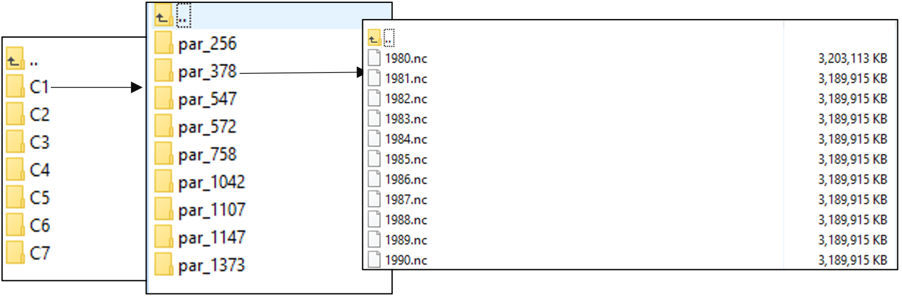

# Calibrated, Ensemble, CLM5 Datasets over CONUS by IM3 Team

## Data Description

Up to 13 calibrated, ensemble CLM5 netcdf output datasets over CONUS at
1/8-degree resolution. The netcdf datasets include all CLM5 output
variables. Simulation time period: 1980 to 2020.

If you have questions, please contact Hongxiang Yan
(<hongxiang.yan@pnnl.gov>)

Please note: if you decide to use this data, please cite the following
reference:

Yan, H., Sun, N., Eldardiry, H., Thurber, T., Reed, P., Malek, K.,
Gupta, R., Kennedy, D., Swenson, S., Hou, Z., Cheng, Y., Rice, J.
Importance of Parameter Uncertainty in the Community Land Model Version
5 (CLM5) for Hydrological Applications. Journal of Advances in Modeling
Earth Systems, under review.

## Data Availability

The dataset is currently available on Globus:

*TODO: insert globus link*

## CLM Model Version

The Community Land Model Version 5 (CLM5), with additional developments to support
parameter evaluation, was used to produce these ensemble data sets. This model version
is tracked as [im3-clm](https://github.com/IMMM-SFA/im3-clm), version v1.0.0.
https://doi.org/10.5281/zenodo.6653705. The additional developments were provided by
the [NCAR](https://ncar.ucar.edu/) development team.

## Meteorological Forcing

Dynamically downscaled ECMWF Reanalysis v5 (ERA5) using WRF through
Thermodynamic Global Warming (TGW) Approach. Deeksha Rastogi (Oak Ridge National Lab),
Pouya Vahmani (Lawrance Berkeley National Lab), Andrew Jones (Lawrance Berkeley
National Lab). Under review. Available on
[Globus](https://app.globus.org/file-manager?origin_id=c296b088-b769-11eb-afd8-e1e7a67e00c1&origin_path=%2F).

The climate forcing was developed collaboratively between the IM3
and HyperFACETS projects, both of which are supported by the U.S. Department of Energy,
Office of Science, as part of research in MultiSector Dynamics, and Regional and Global
Model Analysis, Earth and Environmental System Modeling Program. A portion of this
research used the computing resources of the National Energy Research Scientific
Computing Center (NERSC), a U.S. Department of Energy Office of Science User Facility
located at Lawrence Berkeley National Laboratory, operated under Contract No.
DE-AC02-05CH11231.

Conversion from native WRF output to CLM input was performed by Linying Wang
(Boston University), using code available
[here](https://github.com/IMMM-SFA/urban_clm5/tree/WRF_generated_forcing_for_CLM5).

## Data Structure 

CONUS is classified into 7 clusters (see the picture below, C1 to C7)
and we calibrated a regional parameter for each cluster for a specific
error metric (i.e., all grid cells within each cluster used the same
calibrated parameter). A total of 13 error metrics were used for
calibration to aid in different applications of CLM5.

In each cluster, grid cell number, and latitude and longitude were
provided in the netcdf files. Lake areas were removed in the simulation.

The “par_256” indicates the calibrated parameter number, which is
related to the error metric used in the calibration as shown in the
following table. For example, the par_256 in Cluster 1 indicated the
calibrated simulation using M-MAE and M-TRMSE error metrics.

<table>
<colgroup>
<col style="width: 9%" />
<col style="width: 27%" />
<col style="width: 9%" />
<col style="width: 7%" />
<col style="width: 9%" />
<col style="width: 9%" />
<col style="width: 9%" />
<col style="width: 9%" />
<col style="width: 9%" />
</colgroup>
<thead>
<tr class="header">
<th rowspan="2">Num.</th>
<th rowspan="2">Metric</th>
<th colspan="7">Best Regional Parameter ID</th>
</tr>
<tr class="odd">
<th>C1</th>
<th>C2</th>
<th>C3</th>
<th>C4</th>
<th>C5</th>
<th>C6</th>
<th>C7</th>
</tr>
</thead>
<tbody>
<tr class="odd">
<td>1</td>
<td>M-KGE</td>
<td>1107</td>
<td>256</td>
<td>648</td>
<td>1202</td>
<td>1155</td>
<td>209</td>
<td>1052</td>
</tr>
<tr class="even">
<td>2</td>
<td>M-NSE/M-RMSE</td>
<td>1107</td>
<td>256</td>
<td>66</td>
<td>86</td>
<td>168</td>
<td>1107</td>
<td>1042</td>
</tr>
<tr class="odd">
<td>3</td>
<td>M-MAE</td>
<td>256</td>
<td>256</td>
<td>1110</td>
<td>86</td>
<td>966</td>
<td>209</td>
<td>1042</td>
</tr>
<tr class="even">
<td>4</td>
<td>M-TRMSE</td>
<td>256</td>
<td>549</td>
<td>539</td>
<td>256</td>
<td>966</td>
<td>209</td>
<td>486</td>
</tr>
<tr class="odd">
<td>5</td>
<td>Annual Volume Bias</td>
<td>1373</td>
<td>984</td>
<td>30</td>
<td>1466</td>
<td>1198</td>
<td>573</td>
<td>136</td>
</tr>
<tr class="even">
<td> </td>
<td> </td>
<td> </td>
<td> </td>
<td> </td>
<td> </td>
<td> </td>
<td> </td>
<td> </td>
</tr>
<tr class="odd">
<td>6</td>
<td>D-KGE</td>
<td>1042</td>
<td>669</td>
<td>390</td>
<td>86</td>
<td>966</td>
<td>873</td>
<td>724</td>
</tr>
<tr class="even">
<td>7</td>
<td>D-NSE/D-RMSE</td>
<td>1042</td>
<td>669</td>
<td>1155</td>
<td>86</td>
<td>168</td>
<td>1068</td>
<td>758</td>
</tr>
<tr class="odd">
<td>8</td>
<td>D-MAE</td>
<td>758</td>
<td>572</td>
<td>632</td>
<td>1466</td>
<td>788</td>
<td>1373</td>
<td>783</td>
</tr>
<tr class="even">
<td>9</td>
<td>D-TRMSE</td>
<td>572</td>
<td>256</td>
<td>788</td>
<td>256</td>
<td>788</td>
<td>547</td>
<td>788</td>
</tr>
<tr class="odd">
<td> </td>
<td> </td>
<td> </td>
<td> </td>
<td> </td>
<td> </td>
<td> </td>
<td> </td>
<td> </td>
</tr>
<tr class="even">
<td>10</td>
<td>Winter Volume Bias</td>
<td>547</td>
<td>704</td>
<td>998</td>
<td>1466</td>
<td>1170</td>
<td>840</td>
<td>1243</td>
</tr>
<tr class="odd">
<td>11</td>
<td>Spring Volume Bias</td>
<td>1147</td>
<td>669</td>
<td>148</td>
<td>834</td>
<td>966</td>
<td>1466</td>
<td>1093</td>
</tr>
<tr class="even">
<td>12</td>
<td>Summer Volume Bias</td>
<td>378</td>
<td>549</td>
<td>1485</td>
<td>549</td>
<td>378</td>
<td>290</td>
<td>1415</td>
</tr>
<tr class="odd">
<td>13</td>
<td>Fall Volume Bias</td>
<td>378</td>
<td>984</td>
<td>97</td>
<td>549</td>
<td>1473</td>
<td>937</td>
<td>136</td>
</tr>
</tbody>
</table>

M-KGE: monthly flow KGE; M-NSE: monthly flow NSE; M-RMSE: monthly flow
root-mean-squared-error; M-MAE: monthly flow mean absolute error;
M-TRMSE: monthly flow transformed root-mean-squared-error using box-cox
transformation.

## Calibrated Hydrologic Parameter Sets

A total of 15 hydrologic parameters were selected in the calibration and
provided in the following table.

<table>
<colgroup>
<col style="width: 10%" />
<col style="width: 12%" />
<col style="width: 52%" />
<col style="width: 25%" />
</colgroup>
<thead>
<tr class="header">
<th>Num.</th>
<th>Symbol</th>
<th>Definition</th>
<th>Relevant 
Process</th>
</tr>
</thead>
<tbody>
<tr class="odd">
<td>1</td>
<td>fff</td>
<td>Decay factor for fractional 
saturated area (1/m)</td>
<td>Surface runoff</td>
</tr>
<tr class="even">
<td>2</td>
<td>Nbf</td>
<td>Drainage power exponent</td>
<td>Subsurface runoff</td>
</tr>
<tr class="odd">
<td>3</td>
<td>Kbf</td>
<td>Scalar multiplier for base flow rate</td>
<td>Subsurface runoff</td>
</tr>
<tr class="even">
<td>4</td>
<td>Sy</td>
<td>Minimum specific yield</td>
<td>Subsurface runoff</td>
</tr>
<tr class="odd">
<td>5</td>
<td>B</td>
<td>Scalar multiplier for hydraulic 
conductivity power exponent</td>
<td>Soil water</td>
</tr>
<tr class="even">
<td>6</td>
<td>ψsat</td>
<td>Scalar multiplier for saturated 
soil matric potential</td>
<td>Soil water</td>
</tr>
<tr class="odd">
<td>7</td>
<td>ksat</td>
<td>Scalar multiplier for saturated 
hydraulic conductivity</td>
<td>Soil water</td>
</tr>
<tr class="even">
<td>8</td>
<td>Ɵsat</td>
<td>Scalar multiplier for water content 
at saturation (porosity)</td>
<td>Soil water</td>
</tr>
<tr class="odd">
<td>9</td>
<td>Nmelt</td>
<td>Parameter controlling shape of 
snow covered area</td>
<td>Snow</td>
</tr>
<tr class="even">
<td>10</td>
<td>kacc</td>
<td>Accumulation constant for fractional 
snow covered area</td>
<td>Snow</td>
</tr>
<tr class="odd">
<td>11</td>
<td>psno</td>
<td>Maximum storage of snow on 
leaf surface (kg/m2)</td>
<td>Canopy water</td>
</tr>
<tr class="even">
<td>12</td>
<td>plip</td>
<td>Maximum storage of liquid water 
on leaf surface (kg/m2)</td>
<td>Canopy water</td>
</tr>
<tr class="odd">
<td>13</td>
<td>fwet</td>
<td>Maximum fraction of leaf that 
may be wet prior to drip occuring</td>
<td>Canopy water</td>
</tr>
<tr class="even">
<td>14</td>
<td>dmax</td>
<td>Dry surface layer (DSL) parameter (mm)</td>
<td>Evaporation</td>
</tr>
<tr class="odd">
<td>15</td>
<td>Ɵini</td>
<td>Fraction of saturated soil for moisture 
value at which DSL initiates</td>
<td>Evaporation</td>
</tr>
</tbody>
</table>

The calibrated parameter sets values for each parameter ID in the above
table were:

<table>
<colgroup>
<col style="width: 6%" />
<col style="width: 6%" />
<col style="width: 6%" />
<col style="width: 6%" />
<col style="width: 6%" />
<col style="width: 6%" />
<col style="width: 6%" />
<col style="width: 6%" />
<col style="width: 6%" />
<col style="width: 8%" />
<col style="width: 6%" />
<col style="width: 6%" />
<col style="width: 6%" />
<col style="width: 6%" />
<col style="width: 7%" />
<col style="width: 6%" />
</colgroup>
<thead>
<tr class="header">
<th>Para. 
ID</th>
<th>fff</th>
<th>Nbf</th>
<th>Kbf</th>
<th>Sy</th>
<th>B</th>
<th>ψsat</th>
<th>ksat</th>
<th>Ɵsat</th>
<th>Nmelt</th>
<th>kacc</th>
<th>psno</th>
<th>plip</th>
<th>fwet</th>
<th>dmax</th>
<th>Ɵini</th>
</tr>
</thead>
<tbody>
<tr class="odd">
<td>8</td>
<td>0.32</td>
<td>1.01</td>
<td>0.06</td>
<td>0.02</td>
<td>0.88</td>
<td>4.36</td>
<td>2.83</td>
<td>1.09</td>
<td>204.92</td>
<td>0.21</td>
<td>6.10</td>
<td>1.00</td>
<td>0.02</td>
<td>29.17</td>
<td>0.76</td>
</tr>
<tr class="even">
<td>28</td>
<td>2.49</td>
<td>1.65</td>
<td>0.00</td>
<td>0.01</td>
<td>0.88</td>
<td>0.34</td>
<td>2.55</td>
<td>0.85</td>
<td>202.64</td>
<td>0.18</td>
<td>7.92</td>
<td>1.80</td>
<td>0.02</td>
<td>30.81</td>
<td>0.92</td>
</tr>
<tr class="odd">
<td>30</td>
<td>3.10</td>
<td>1.86</td>
<td>0.05</td>
<td>0.02</td>
<td>1.11</td>
<td>1.27</td>
<td>3.95</td>
<td>0.91</td>
<td>210.49</td>
<td>0.36</td>
<td>5.80</td>
<td>1.66</td>
<td>0.42</td>
<td>27.48</td>
<td>0.52</td>
</tr>
<tr class="even">
<td>50</td>
<td>4.48</td>
<td>1.92</td>
<td>0.09</td>
<td>0.01</td>
<td>0.89</td>
<td>3.82</td>
<td>2.50</td>
<td>1.16</td>
<td>205.11</td>
<td>0.17</td>
<td>3.10</td>
<td>0.25</td>
<td>0.33</td>
<td>12.84</td>
<td>0.68</td>
</tr>
<tr class="odd">
<td>66</td>
<td>3.77</td>
<td>1.31</td>
<td>0.03</td>
<td>0.01</td>
<td>1.08</td>
<td>4.68</td>
<td>4.17</td>
<td>1.05</td>
<td>213.98</td>
<td>0.18</td>
<td>8.24</td>
<td>1.94</td>
<td>0.27</td>
<td>44.82</td>
<td>0.57</td>
</tr>
<tr class="even">
<td>86</td>
<td>1.40</td>
<td>1.90</td>
<td>0.00</td>
<td>0.01</td>
<td>0.90</td>
<td>3.01</td>
<td>3.24</td>
<td>1.13</td>
<td>207.82</td>
<td>0.40</td>
<td>5.75</td>
<td>1.97</td>
<td>0.41</td>
<td>12.63</td>
<td>0.54</td>
</tr>
<tr class="odd">
<td>97</td>
<td>0.73</td>
<td>1.25</td>
<td>0.01</td>
<td>0.02</td>
<td>0.84</td>
<td>1.35</td>
<td>3.54</td>
<td>1.10</td>
<td>210.85</td>
<td>0.23</td>
<td>2.40</td>
<td>1.33</td>
<td>0.24</td>
<td>54.83</td>
<td>0.99</td>
</tr>
<tr class="even">
<td>106</td>
<td>1.81</td>
<td>1.35</td>
<td>0.01</td>
<td>0.01</td>
<td>0.97</td>
<td>0.49</td>
<td>1.50</td>
<td>1.06</td>
<td>189.08</td>
<td>0.29</td>
<td>9.41</td>
<td>1.62</td>
<td>0.01</td>
<td>59.22</td>
<td>0.56</td>
</tr>
<tr class="odd">
<td>108</td>
<td>4.24</td>
<td>1.31</td>
<td>0.07</td>
<td>0.02</td>
<td>1.08</td>
<td>3.17</td>
<td>3.44</td>
<td>1.07</td>
<td>219.67</td>
<td>0.23</td>
<td>7.80</td>
<td>1.68</td>
<td>0.36</td>
<td>34.88</td>
<td>0.85</td>
</tr>
<tr class="even">
<td>125</td>
<td>4.94</td>
<td>1.28</td>
<td>0.09</td>
<td>0.01</td>
<td>0.90</td>
<td>0.43</td>
<td>1.42</td>
<td>0.81</td>
<td>212.53</td>
<td>0.18</td>
<td>5.63</td>
<td>1.84</td>
<td>0.48</td>
<td>17.59</td>
<td>0.56</td>
</tr>
<tr class="odd">
<td>136</td>
<td>0.18</td>
<td>1.63</td>
<td>0.04</td>
<td>0.02</td>
<td>1.04</td>
<td>0.37</td>
<td>1.87</td>
<td>0.85</td>
<td>196.93</td>
<td>0.38</td>
<td>6.73</td>
<td>0.31</td>
<td>0.15</td>
<td>58.89</td>
<td>0.53</td>
</tr>
<tr class="even">
<td>148</td>
<td>1.72</td>
<td>1.72</td>
<td>0.07</td>
<td>0.02</td>
<td>1.10</td>
<td>0.33</td>
<td>3.36</td>
<td>1.03</td>
<td>202.60</td>
<td>0.24</td>
<td>7.75</td>
<td>0.21</td>
<td>0.33</td>
<td>25.65</td>
<td>0.93</td>
</tr>
<tr class="odd">
<td>168</td>
<td>2.56</td>
<td>1.99</td>
<td>0.01</td>
<td>0.02</td>
<td>1.10</td>
<td>4.71</td>
<td>3.56</td>
<td>1.18</td>
<td>203.49</td>
<td>0.22</td>
<td>3.65</td>
<td>0.85</td>
<td>0.11</td>
<td>16.14</td>
<td>0.50</td>
</tr>
<tr class="even">
<td>196</td>
<td>0.79</td>
<td>1.85</td>
<td>0.03</td>
<td>0.02</td>
<td>1.20</td>
<td>3.08</td>
<td>4.72</td>
<td>1.09</td>
<td>182.25</td>
<td>0.38</td>
<td>7.68</td>
<td>1.70</td>
<td>0.43</td>
<td>47.05</td>
<td>0.68</td>
</tr>
<tr class="odd">
<td>209</td>
<td>0.04</td>
<td>1.95</td>
<td>0.08</td>
<td>0.02</td>
<td>1.15</td>
<td>4.73</td>
<td>0.87</td>
<td>1.10</td>
<td>185.27</td>
<td>0.20</td>
<td>8.58</td>
<td>1.13</td>
<td>0.39</td>
<td>20.49</td>
<td>0.65</td>
</tr>
<tr class="even">
<td>227</td>
<td>0.25</td>
<td>1.23</td>
<td>0.07</td>
<td>0.02</td>
<td>1.14</td>
<td>2.33</td>
<td>1.68</td>
<td>1.01</td>
<td>209.87</td>
<td>0.26</td>
<td>8.69</td>
<td>1.01</td>
<td>0.05</td>
<td>33.43</td>
<td>0.69</td>
</tr>
<tr class="odd">
<td>231</td>
<td>0.35</td>
<td>1.98</td>
<td>0.01</td>
<td>0.01</td>
<td>1.05</td>
<td>0.60</td>
<td>2.73</td>
<td>0.89</td>
<td>212.65</td>
<td>0.37</td>
<td>4.92</td>
<td>0.40</td>
<td>0.43</td>
<td>47.55</td>
<td>0.95</td>
</tr>
<tr class="even">
<td>234</td>
<td>0.57</td>
<td>1.11</td>
<td>0.00</td>
<td>0.02</td>
<td>0.97</td>
<td>1.85</td>
<td>3.78</td>
<td>1.01</td>
<td>207.89</td>
<td>0.38</td>
<td>4.76</td>
<td>1.95</td>
<td>0.14</td>
<td>30.76</td>
<td>0.59</td>
</tr>
<tr class="odd">
<td>239</td>
<td>2.76</td>
<td>1.41</td>
<td>0.04</td>
<td>0.02</td>
<td>0.88</td>
<td>0.29</td>
<td>1.50</td>
<td>0.83</td>
<td>184.54</td>
<td>0.32</td>
<td>7.92</td>
<td>0.06</td>
<td>0.40</td>
<td>46.34</td>
<td>1.00</td>
</tr>
<tr class="even">
<td>256</td>
<td>0.35</td>
<td>1.98</td>
<td>0.00</td>
<td>0.01</td>
<td>0.85</td>
<td>0.15</td>
<td>2.53</td>
<td>0.90</td>
<td>219.32</td>
<td>0.18</td>
<td>2.19</td>
<td>0.10</td>
<td>0.44</td>
<td>17.71</td>
<td>0.75</td>
</tr>
<tr class="odd">
<td>290</td>
<td>2.00</td>
<td>1.40</td>
<td>0.04</td>
<td>0.01</td>
<td>0.94</td>
<td>4.67</td>
<td>3.52</td>
<td>1.12</td>
<td>197.53</td>
<td>0.38</td>
<td>2.82</td>
<td>1.66</td>
<td>0.29</td>
<td>33.86</td>
<td>0.69</td>
</tr>
<tr class="even">
<td>378</td>
<td>0.03</td>
<td>1.26</td>
<td>0.05</td>
<td>0.02</td>
<td>1.19</td>
<td>3.23</td>
<td>3.70</td>
<td>1.04</td>
<td>199.22</td>
<td>0.38</td>
<td>6.50</td>
<td>0.09</td>
<td>0.32</td>
<td>19.56</td>
<td>0.78</td>
</tr>
<tr class="odd">
<td>390</td>
<td>4.06</td>
<td>1.21</td>
<td>0.00</td>
<td>0.02</td>
<td>1.00</td>
<td>1.35</td>
<td>1.62</td>
<td>0.86</td>
<td>216.48</td>
<td>0.15</td>
<td>5.99</td>
<td>1.60</td>
<td>0.42</td>
<td>27.93</td>
<td>0.58</td>
</tr>
<tr class="even">
<td>416</td>
<td>4.91</td>
<td>1.94</td>
<td>0.05</td>
<td>0.01</td>
<td>0.94</td>
<td>1.74</td>
<td>2.29</td>
<td>1.01</td>
<td>190.44</td>
<td>0.33</td>
<td>6.72</td>
<td>1.86</td>
<td>0.28</td>
<td>20.41</td>
<td>0.84</td>
</tr>
<tr class="odd">
<td>486</td>
<td>1.14</td>
<td>1.25</td>
<td>0.00</td>
<td>0.01</td>
<td>0.85</td>
<td>0.86</td>
<td>4.01</td>
<td>0.81</td>
<td>202.47</td>
<td>0.14</td>
<td>7.12</td>
<td>1.44</td>
<td>0.03</td>
<td>36.96</td>
<td>0.84</td>
</tr>
<tr class="even">
<td>535</td>
<td>1.81</td>
<td>1.23</td>
<td>0.02</td>
<td>0.02</td>
<td>0.99</td>
<td>1.58</td>
<td>2.69</td>
<td>0.89</td>
<td>208.45</td>
<td>0.12</td>
<td>7.61</td>
<td>1.29</td>
<td>0.08</td>
<td>59.24</td>
<td>0.63</td>
</tr>
<tr class="odd">
<td>539</td>
<td>4.46</td>
<td>1.88</td>
<td>0.09</td>
<td>0.02</td>
<td>0.87</td>
<td>0.61</td>
<td>0.13</td>
<td>1.08</td>
<td>188.00</td>
<td>0.29</td>
<td>4.99</td>
<td>0.67</td>
<td>0.26</td>
<td>16.81</td>
<td>0.89</td>
</tr>
<tr class="even">
<td>547</td>
<td>0.44</td>
<td>1.02</td>
<td>0.03</td>
<td>0.01</td>
<td>1.04</td>
<td>0.38</td>
<td>1.57</td>
<td>1.13</td>
<td>181.43</td>
<td>0.16</td>
<td>2.18</td>
<td>1.48</td>
<td>0.17</td>
<td>46.09</td>
<td>0.53</td>
</tr>
<tr class="odd">
<td>549</td>
<td>0.03</td>
<td>1.34</td>
<td>0.00</td>
<td>0.01</td>
<td>0.83</td>
<td>4.52</td>
<td>0.66</td>
<td>1.03</td>
<td>187.01</td>
<td>0.28</td>
<td>2.82</td>
<td>0.19</td>
<td>0.08</td>
<td>39.72</td>
<td>0.72</td>
</tr>
<tr class="even">
<td>562</td>
<td>3.37</td>
<td>1.72</td>
<td>0.00</td>
<td>0.02</td>
<td>0.82</td>
<td>3.12</td>
<td>1.35</td>
<td>0.84</td>
<td>212.21</td>
<td>0.38</td>
<td>2.88</td>
<td>0.80</td>
<td>0.28</td>
<td>50.39</td>
<td>0.77</td>
</tr>
<tr class="odd">
<td>572</td>
<td>3.70</td>
<td>1.95</td>
<td>0.01</td>
<td>0.01</td>
<td>0.91</td>
<td>0.13</td>
<td>3.77</td>
<td>0.96</td>
<td>216.89</td>
<td>0.19</td>
<td>5.53</td>
<td>0.37</td>
<td>0.12</td>
<td>54.78</td>
<td>0.67</td>
</tr>
<tr class="even">
<td>573</td>
<td>4.34</td>
<td>1.80</td>
<td>0.01</td>
<td>0.01</td>
<td>1.04</td>
<td>1.48</td>
<td>1.22</td>
<td>1.09</td>
<td>203.47</td>
<td>0.39</td>
<td>2.73</td>
<td>1.12</td>
<td>0.47</td>
<td>28.52</td>
<td>0.83</td>
</tr>
<tr class="odd">
<td>602</td>
<td>3.71</td>
<td>1.91</td>
<td>0.06</td>
<td>0.02</td>
<td>0.98</td>
<td>2.03</td>
<td>3.07</td>
<td>0.94</td>
<td>203.60</td>
<td>0.40</td>
<td>3.42</td>
<td>1.21</td>
<td>0.40</td>
<td>19.71</td>
<td>0.58</td>
</tr>
<tr class="even">
<td>608</td>
<td>3.73</td>
<td>1.27</td>
<td>0.01</td>
<td>0.02</td>
<td>0.90</td>
<td>2.56</td>
<td>3.49</td>
<td>1.05</td>
<td>215.23</td>
<td>0.11</td>
<td>7.83</td>
<td>1.50</td>
<td>0.33</td>
<td>13.93</td>
<td>0.61</td>
</tr>
<tr class="odd">
<td>609</td>
<td>4.52</td>
<td>1.60</td>
<td>0.00</td>
<td>0.01</td>
<td>0.83</td>
<td>0.56</td>
<td>1.34</td>
<td>1.17</td>
<td>216.56</td>
<td>0.31</td>
<td>2.37</td>
<td>1.28</td>
<td>0.37</td>
<td>53.21</td>
<td>0.56</td>
</tr>
<tr class="even">
<td>632</td>
<td>4.76</td>
<td>1.55</td>
<td>0.03</td>
<td>0.01</td>
<td>0.97</td>
<td>3.90</td>
<td>1.49</td>
<td>1.13</td>
<td>182.07</td>
<td>0.22</td>
<td>3.15</td>
<td>1.85</td>
<td>0.50</td>
<td>25.98</td>
<td>0.52</td>
</tr>
<tr class="odd">
<td>639</td>
<td>0.41</td>
<td>1.63</td>
<td>0.07</td>
<td>0.01</td>
<td>0.82</td>
<td>3.26</td>
<td>2.93</td>
<td>1.20</td>
<td>216.00</td>
<td>0.37</td>
<td>5.28</td>
<td>1.95</td>
<td>0.44</td>
<td>21.16</td>
<td>0.97</td>
</tr>
<tr class="even">
<td>646</td>
<td>0.20</td>
<td>1.66</td>
<td>0.04</td>
<td>0.02</td>
<td>0.96</td>
<td>3.99</td>
<td>0.42</td>
<td>1.14</td>
<td>216.27</td>
<td>0.31</td>
<td>7.67</td>
<td>1.56</td>
<td>0.19</td>
<td>49.81</td>
<td>0.93</td>
</tr>
<tr class="odd">
<td>648</td>
<td>3.64</td>
<td>1.16</td>
<td>0.05</td>
<td>0.02</td>
<td>1.08</td>
<td>1.37</td>
<td>3.75</td>
<td>1.01</td>
<td>211.72</td>
<td>0.33</td>
<td>2.14</td>
<td>1.17</td>
<td>0.05</td>
<td>35.88</td>
<td>0.51</td>
</tr>
<tr class="even">
<td>669</td>
<td>1.50</td>
<td>1.14</td>
<td>0.00</td>
<td>0.01</td>
<td>0.91</td>
<td>0.19</td>
<td>4.92</td>
<td>1.05</td>
<td>199.71</td>
<td>0.15</td>
<td>4.45</td>
<td>0.53</td>
<td>0.02</td>
<td>31.87</td>
<td>0.81</td>
</tr>
<tr class="odd">
<td>704</td>
<td>4.23</td>
<td>1.28</td>
<td>0.06</td>
<td>0.01</td>
<td>0.83</td>
<td>3.45</td>
<td>1.93</td>
<td>0.83</td>
<td>184.44</td>
<td>0.15</td>
<td>6.48</td>
<td>0.24</td>
<td>0.03</td>
<td>43.24</td>
<td>0.81</td>
</tr>
<tr class="even">
<td>724</td>
<td>2.34</td>
<td>1.98</td>
<td>0.01</td>
<td>0.02</td>
<td>1.12</td>
<td>0.21</td>
<td>4.46</td>
<td>0.89</td>
<td>187.96</td>
<td>0.18</td>
<td>5.88</td>
<td>1.82</td>
<td>0.27</td>
<td>55.33</td>
<td>0.66</td>
</tr>
<tr class="odd">
<td>755</td>
<td>2.39</td>
<td>1.20</td>
<td>0.10</td>
<td>0.01</td>
<td>1.17</td>
<td>0.85</td>
<td>0.93</td>
<td>1.13</td>
<td>210.69</td>
<td>0.10</td>
<td>9.45</td>
<td>0.97</td>
<td>0.23</td>
<td>11.77</td>
<td>0.90</td>
</tr>
<tr class="even">
<td>758</td>
<td>3.31</td>
<td>1.80</td>
<td>0.01</td>
<td>0.01</td>
<td>0.82</td>
<td>0.30</td>
<td>4.79</td>
<td>1.19</td>
<td>219.00</td>
<td>0.18</td>
<td>5.02</td>
<td>0.74</td>
<td>0.10</td>
<td>48.32</td>
<td>0.62</td>
</tr>
<tr class="odd">
<td>783</td>
<td>3.08</td>
<td>1.48</td>
<td>0.00</td>
<td>0.01</td>
<td>1.15</td>
<td>0.72</td>
<td>3.19</td>
<td>0.99</td>
<td>199.09</td>
<td>0.10</td>
<td>2.94</td>
<td>1.98</td>
<td>0.35</td>
<td>36.43</td>
<td>0.63</td>
</tr>
<tr class="even">
<td>786</td>
<td>1.20</td>
<td>1.34</td>
<td>0.06</td>
<td>0.02</td>
<td>0.99</td>
<td>2.17</td>
<td>4.19</td>
<td>1.01</td>
<td>211.80</td>
<td>0.30</td>
<td>7.73</td>
<td>1.21</td>
<td>0.27</td>
<td>16.11</td>
<td>0.76</td>
</tr>
<tr class="odd">
<td>788</td>
<td>4.87</td>
<td>1.01</td>
<td>0.00</td>
<td>0.01</td>
<td>0.99</td>
<td>0.86</td>
<td>0.82</td>
<td>1.14</td>
<td>194.78</td>
<td>0.25</td>
<td>6.31</td>
<td>0.21</td>
<td>0.13</td>
<td>32.59</td>
<td>0.85</td>
</tr>
<tr class="even">
<td>801</td>
<td>1.07</td>
<td>1.89</td>
<td>0.03</td>
<td>0.01</td>
<td>1.06</td>
<td>3.34</td>
<td>3.84</td>
<td>1.16</td>
<td>183.01</td>
<td>0.23</td>
<td>1.85</td>
<td>1.68</td>
<td>0.32</td>
<td>10.28</td>
<td>0.74</td>
</tr>
<tr class="odd">
<td>811</td>
<td>0.59</td>
<td>1.05</td>
<td>0.00</td>
<td>0.01</td>
<td>0.88</td>
<td>4.18</td>
<td>2.84</td>
<td>1.12</td>
<td>184.81</td>
<td>0.29</td>
<td>7.40</td>
<td>1.74</td>
<td>0.10</td>
<td>25.48</td>
<td>0.64</td>
</tr>
<tr class="even">
<td>812</td>
<td>4.18</td>
<td>1.76</td>
<td>0.02</td>
<td>0.01</td>
<td>1.13</td>
<td>4.30</td>
<td>0.55</td>
<td>0.87</td>
<td>181.99</td>
<td>0.19</td>
<td>9.11</td>
<td>0.23</td>
<td>0.26</td>
<td>19.41</td>
<td>0.60</td>
</tr>
<tr class="odd">
<td>831</td>
<td>1.95</td>
<td>1.97</td>
<td>0.08</td>
<td>0.01</td>
<td>0.97</td>
<td>1.25</td>
<td>1.38</td>
<td>1.08</td>
<td>192.71</td>
<td>0.25</td>
<td>9.43</td>
<td>1.51</td>
<td>0.46</td>
<td>43.68</td>
<td>0.65</td>
</tr>
<tr class="even">
<td>834</td>
<td>3.01</td>
<td>1.33</td>
<td>0.04</td>
<td>0.01</td>
<td>0.91</td>
<td>0.99</td>
<td>4.14</td>
<td>1.19</td>
<td>200.88</td>
<td>0.11</td>
<td>8.97</td>
<td>1.69</td>
<td>0.48</td>
<td>11.61</td>
<td>0.55</td>
</tr>
<tr class="odd">
<td>840</td>
<td>2.79</td>
<td>1.42</td>
<td>0.05</td>
<td>0.02</td>
<td>1.13</td>
<td>2.89</td>
<td>2.85</td>
<td>0.92</td>
<td>192.50</td>
<td>0.35</td>
<td>3.57</td>
<td>0.54</td>
<td>0.27</td>
<td>16.65</td>
<td>0.98</td>
</tr>
<tr class="even">
<td>873</td>
<td>0.04</td>
<td>1.93</td>
<td>0.01</td>
<td>0.02</td>
<td>1.17</td>
<td>4.53</td>
<td>4.44</td>
<td>0.96</td>
<td>210.32</td>
<td>0.33</td>
<td>2.68</td>
<td>0.64</td>
<td>0.41</td>
<td>32.41</td>
<td>0.90</td>
</tr>
<tr class="odd">
<td>901</td>
<td>0.07</td>
<td>1.94</td>
<td>0.02</td>
<td>0.01</td>
<td>1.09</td>
<td>3.93</td>
<td>4.08</td>
<td>1.20</td>
<td>184.27</td>
<td>0.17</td>
<td>4.27</td>
<td>0.49</td>
<td>0.22</td>
<td>40.63</td>
<td>0.69</td>
</tr>
<tr class="even">
<td>930</td>
<td>4.33</td>
<td>1.19</td>
<td>0.03</td>
<td>0.02</td>
<td>0.95</td>
<td>4.75</td>
<td>3.43</td>
<td>0.97</td>
<td>190.71</td>
<td>0.39</td>
<td>9.17</td>
<td>0.08</td>
<td>0.23</td>
<td>51.83</td>
<td>0.96</td>
</tr>
<tr class="odd">
<td>937</td>
<td>0.57</td>
<td>1.27</td>
<td>0.02</td>
<td>0.01</td>
<td>0.88</td>
<td>0.83</td>
<td>1.80</td>
<td>1.11</td>
<td>212.25</td>
<td>0.25</td>
<td>7.09</td>
<td>0.48</td>
<td>0.18</td>
<td>31.92</td>
<td>0.70</td>
</tr>
<tr class="even">
<td>940</td>
<td>1.67</td>
<td>1.13</td>
<td>0.00</td>
<td>0.02</td>
<td>1.04</td>
<td>2.52</td>
<td>0.61</td>
<td>0.82</td>
<td>189.44</td>
<td>0.24</td>
<td>5.91</td>
<td>0.98</td>
<td>0.12</td>
<td>27.27</td>
<td>0.97</td>
</tr>
<tr class="odd">
<td>966</td>
<td>3.65</td>
<td>1.59</td>
<td>0.07</td>
<td>0.02</td>
<td>0.81</td>
<td>4.17</td>
<td>3.51</td>
<td>0.96</td>
<td>213.20</td>
<td>0.19</td>
<td>2.98</td>
<td>1.43</td>
<td>0.47</td>
<td>10.30</td>
<td>0.50</td>
</tr>
<tr class="even">
<td>967</td>
<td>4.94</td>
<td>1.15</td>
<td>0.00</td>
<td>0.02</td>
<td>0.87</td>
<td>2.38</td>
<td>0.76</td>
<td>1.02</td>
<td>214.19</td>
<td>0.16</td>
<td>4.17</td>
<td>0.95</td>
<td>0.47</td>
<td>18.40</td>
<td>0.60</td>
</tr>
<tr class="odd">
<td>976</td>
<td>1.84</td>
<td>1.31</td>
<td>0.09</td>
<td>0.02</td>
<td>1.18</td>
<td>0.98</td>
<td>4.05</td>
<td>0.95</td>
<td>202.90</td>
<td>0.32</td>
<td>6.35</td>
<td>0.20</td>
<td>0.01</td>
<td>56.22</td>
<td>0.59</td>
</tr>
<tr class="even">
<td>984</td>
<td>2.40</td>
<td>1.08</td>
<td>0.07</td>
<td>0.01</td>
<td>1.09</td>
<td>1.10</td>
<td>2.43</td>
<td>0.81</td>
<td>203.29</td>
<td>0.11</td>
<td>5.22</td>
<td>0.06</td>
<td>0.04</td>
<td>44.92</td>
<td>0.57</td>
</tr>
<tr class="odd">
<td>998</td>
<td>3.31</td>
<td>1.05</td>
<td>0.03</td>
<td>0.02</td>
<td>0.97</td>
<td>4.49</td>
<td>3.53</td>
<td>1.16</td>
<td>210.40</td>
<td>0.36</td>
<td>9.43</td>
<td>0.50</td>
<td>0.19</td>
<td>47.30</td>
<td>0.96</td>
</tr>
<tr class="even">
<td>1000</td>
<td>0.11</td>
<td>1.44</td>
<td>0.06</td>
<td>0.02</td>
<td>0.89</td>
<td>2.33</td>
<td>3.51</td>
<td>0.99</td>
<td>196.54</td>
<td>0.38</td>
<td>8.31</td>
<td>1.23</td>
<td>0.01</td>
<td>20.69</td>
<td>0.70</td>
</tr>
<tr class="odd">
<td>1020</td>
<td>2.17</td>
<td>1.43</td>
<td>0.02</td>
<td>0.01</td>
<td>0.91</td>
<td>0.11</td>
<td>1.67</td>
<td>0.98</td>
<td>197.49</td>
<td>0.10</td>
<td>2.34</td>
<td>0.27</td>
<td>0.02</td>
<td>33.75</td>
<td>0.92</td>
</tr>
<tr class="even">
<td>1042</td>
<td>0.29</td>
<td>1.15</td>
<td>0.00</td>
<td>0.02</td>
<td>0.85</td>
<td>0.47</td>
<td>4.82</td>
<td>1.07</td>
<td>207.53</td>
<td>0.38</td>
<td>9.11</td>
<td>1.77</td>
<td>0.15</td>
<td>31.67</td>
<td>0.73</td>
</tr>
<tr class="odd">
<td>1052</td>
<td>0.17</td>
<td>1.43</td>
<td>0.01</td>
<td>0.02</td>
<td>0.96</td>
<td>4.70</td>
<td>4.10</td>
<td>0.99</td>
<td>202.33</td>
<td>0.16</td>
<td>2.45</td>
<td>0.14</td>
<td>0.43</td>
<td>41.91</td>
<td>0.76</td>
</tr>
<tr class="even">
<td>1068</td>
<td>0.28</td>
<td>1.06</td>
<td>0.05</td>
<td>0.01</td>
<td>0.96</td>
<td>0.40</td>
<td>3.00</td>
<td>1.17</td>
<td>215.90</td>
<td>0.14</td>
<td>2.06</td>
<td>0.53</td>
<td>0.50</td>
<td>27.65</td>
<td>0.59</td>
</tr>
<tr class="odd">
<td>1083</td>
<td>0.20</td>
<td>1.70</td>
<td>0.06</td>
<td>0.02</td>
<td>0.88</td>
<td>3.07</td>
<td>3.47</td>
<td>1.10</td>
<td>198.67</td>
<td>0.24</td>
<td>7.94</td>
<td>1.54</td>
<td>0.32</td>
<td>16.23</td>
<td>0.90</td>
</tr>
<tr class="even">
<td>1093</td>
<td>1.45</td>
<td>1.94</td>
<td>0.06</td>
<td>0.01</td>
<td>0.89</td>
<td>1.53</td>
<td>2.02</td>
<td>0.90</td>
<td>216.95</td>
<td>0.13</td>
<td>6.77</td>
<td>0.22</td>
<td>0.03</td>
<td>50.20</td>
<td>0.94</td>
</tr>
<tr class="odd">
<td>1105</td>
<td>0.37</td>
<td>1.45</td>
<td>0.07</td>
<td>0.02</td>
<td>0.87</td>
<td>2.29</td>
<td>2.56</td>
<td>1.07</td>
<td>211.89</td>
<td>0.38</td>
<td>3.08</td>
<td>0.65</td>
<td>0.29</td>
<td>55.14</td>
<td>0.70</td>
</tr>
<tr class="even">
<td>1107</td>
<td>0.06</td>
<td>1.24</td>
<td>0.07</td>
<td>0.02</td>
<td>1.14</td>
<td>1.12</td>
<td>3.41</td>
<td>1.14</td>
<td>211.11</td>
<td>0.19</td>
<td>2.49</td>
<td>1.41</td>
<td>0.31</td>
<td>53.77</td>
<td>0.79</td>
</tr>
<tr class="odd">
<td>1110</td>
<td>4.97</td>
<td>1.42</td>
<td>0.01</td>
<td>0.02</td>
<td>1.13</td>
<td>4.33</td>
<td>1.59</td>
<td>1.02</td>
<td>192.32</td>
<td>0.24</td>
<td>6.27</td>
<td>1.72</td>
<td>0.04</td>
<td>34.78</td>
<td>0.56</td>
</tr>
<tr class="even">
<td>1147</td>
<td>0.08</td>
<td>1.37</td>
<td>0.03</td>
<td>0.01</td>
<td>1.10</td>
<td>1.33</td>
<td>4.50</td>
<td>1.16</td>
<td>206.83</td>
<td>0.26</td>
<td>3.07</td>
<td>1.95</td>
<td>0.34</td>
<td>53.09</td>
<td>0.94</td>
</tr>
<tr class="odd">
<td>1149</td>
<td>3.35</td>
<td>1.33</td>
<td>0.03</td>
<td>0.01</td>
<td>0.92</td>
<td>1.81</td>
<td>3.40</td>
<td>1.02</td>
<td>200.93</td>
<td>0.17</td>
<td>6.38</td>
<td>1.67</td>
<td>0.43</td>
<td>45.44</td>
<td>0.69</td>
</tr>
<tr class="even">
<td>1155</td>
<td>3.64</td>
<td>1.53</td>
<td>0.00</td>
<td>0.02</td>
<td>1.06</td>
<td>1.59</td>
<td>4.82</td>
<td>1.11</td>
<td>180.14</td>
<td>0.16</td>
<td>2.75</td>
<td>1.74</td>
<td>0.03</td>
<td>11.33</td>
<td>0.54</td>
</tr>
<tr class="odd">
<td>1170</td>
<td>3.19</td>
<td>1.21</td>
<td>0.04</td>
<td>0.01</td>
<td>0.89</td>
<td>1.29</td>
<td>3.72</td>
<td>0.85</td>
<td>187.50</td>
<td>0.35</td>
<td>7.34</td>
<td>1.77</td>
<td>0.15</td>
<td>18.50</td>
<td>0.55</td>
</tr>
<tr class="even">
<td>1198</td>
<td>4.35</td>
<td>1.80</td>
<td>0.05</td>
<td>0.01</td>
<td>1.03</td>
<td>3.81</td>
<td>4.57</td>
<td>1.03</td>
<td>218.27</td>
<td>0.22</td>
<td>4.30</td>
<td>0.44</td>
<td>0.26</td>
<td>15.45</td>
<td>0.53</td>
</tr>
<tr class="odd">
<td>1202</td>
<td>0.55</td>
<td>1.17</td>
<td>0.02</td>
<td>0.01</td>
<td>0.87</td>
<td>4.49</td>
<td>3.01</td>
<td>1.17</td>
<td>182.70</td>
<td>0.30</td>
<td>8.98</td>
<td>1.50</td>
<td>0.25</td>
<td>10.69</td>
<td>0.82</td>
</tr>
<tr class="even">
<td>1243</td>
<td>0.51</td>
<td>1.08</td>
<td>0.09</td>
<td>0.01</td>
<td>1.07</td>
<td>0.17</td>
<td>4.02</td>
<td>0.85</td>
<td>195.83</td>
<td>0.20</td>
<td>6.89</td>
<td>0.61</td>
<td>0.23</td>
<td>38.06</td>
<td>0.68</td>
</tr>
<tr class="odd">
<td>1254</td>
<td>4.73</td>
<td>1.99</td>
<td>0.01</td>
<td>0.02</td>
<td>0.92</td>
<td>1.77</td>
<td>1.25</td>
<td>1.09</td>
<td>193.93</td>
<td>0.34</td>
<td>7.55</td>
<td>1.74</td>
<td>0.17</td>
<td>57.62</td>
<td>0.53</td>
</tr>
<tr class="even">
<td>1287</td>
<td>1.35</td>
<td>1.62</td>
<td>0.06</td>
<td>0.01</td>
<td>0.96</td>
<td>4.26</td>
<td>3.07</td>
<td>1.19</td>
<td>186.26</td>
<td>0.28</td>
<td>7.80</td>
<td>0.10</td>
<td>0.35</td>
<td>10.17</td>
<td>0.74</td>
</tr>
<tr class="odd">
<td>1292</td>
<td>3.48</td>
<td>1.67</td>
<td>0.09</td>
<td>0.01</td>
<td>1.11</td>
<td>0.70</td>
<td>2.11</td>
<td>1.09</td>
<td>217.25</td>
<td>0.38</td>
<td>3.52</td>
<td>1.93</td>
<td>0.20</td>
<td>24.28</td>
<td>0.64</td>
</tr>
<tr class="even">
<td>1313</td>
<td>0.63</td>
<td>1.81</td>
<td>0.00</td>
<td>0.01</td>
<td>0.94</td>
<td>4.10</td>
<td>1.77</td>
<td>0.97</td>
<td>183.85</td>
<td>0.24</td>
<td>8.16</td>
<td>0.60</td>
<td>0.44</td>
<td>45.55</td>
<td>0.98</td>
</tr>
<tr class="odd">
<td>1358</td>
<td>0.09</td>
<td>1.33</td>
<td>0.02</td>
<td>0.01</td>
<td>0.98</td>
<td>0.56</td>
<td>0.36</td>
<td>0.80</td>
<td>186.79</td>
<td>0.13</td>
<td>4.34</td>
<td>0.07</td>
<td>0.12</td>
<td>14.49</td>
<td>0.67</td>
</tr>
<tr class="even">
<td>1373</td>
<td>0.21</td>
<td>1.43</td>
<td>0.02</td>
<td>0.01</td>
<td>1.00</td>
<td>3.65</td>
<td>3.23</td>
<td>1.11</td>
<td>186.92</td>
<td>0.31</td>
<td>3.94</td>
<td>1.98</td>
<td>0.33</td>
<td>30.54</td>
<td>0.51</td>
</tr>
<tr class="odd">
<td>1383</td>
<td>4.71</td>
<td>1.48</td>
<td>0.02</td>
<td>0.01</td>
<td>1.02</td>
<td>3.48</td>
<td>2.20</td>
<td>1.11</td>
<td>182.60</td>
<td>0.16</td>
<td>2.41</td>
<td>1.00</td>
<td>0.04</td>
<td>38.39</td>
<td>0.81</td>
</tr>
<tr class="even">
<td>1415</td>
<td>0.10</td>
<td>1.67</td>
<td>0.02</td>
<td>0.02</td>
<td>1.12</td>
<td>4.24</td>
<td>3.08</td>
<td>0.86</td>
<td>219.78</td>
<td>0.19</td>
<td>7.03</td>
<td>0.14</td>
<td>0.49</td>
<td>46.70</td>
<td>0.98</td>
</tr>
<tr class="odd">
<td>1443</td>
<td>3.06</td>
<td>1.73</td>
<td>0.03</td>
<td>0.02</td>
<td>1.08</td>
<td>1.43</td>
<td>2.58</td>
<td>1.09</td>
<td>182.91</td>
<td>0.24</td>
<td>4.02</td>
<td>1.91</td>
<td>0.21</td>
<td>48.44</td>
<td>0.90</td>
</tr>
<tr class="even">
<td>1466</td>
<td>4.08</td>
<td>1.26</td>
<td>0.00</td>
<td>0.02</td>
<td>1.18</td>
<td>1.39</td>
<td>1.95</td>
<td>1.19</td>
<td>183.38</td>
<td>0.11</td>
<td>7.56</td>
<td>0.34</td>
<td>0.45</td>
<td>10.74</td>
<td>0.56</td>
</tr>
<tr class="odd">
<td>1473</td>
<td>4.99</td>
<td>1.96</td>
<td>0.08</td>
<td>0.01</td>
<td>1.18</td>
<td>1.55</td>
<td>2.89</td>
<td>0.82</td>
<td>182.84</td>
<td>0.15</td>
<td>5.93</td>
<td>1.50</td>
<td>0.16</td>
<td>16.88</td>
<td>0.56</td>
</tr>
<tr class="even">
<td>1485</td>
<td>4.57</td>
<td>1.55</td>
<td>0.08</td>
<td>0.02</td>
<td>1.15</td>
<td>4.06</td>
<td>1.24</td>
<td>1.03</td>
<td>197.23</td>
<td>0.30</td>
<td>7.15</td>
<td>1.87</td>
<td>0.06</td>
<td>26.47</td>
<td>0.86</td>
</tr>
<tr class="odd">
<td>1493</td>
<td>3.06</td>
<td>1.99</td>
<td>0.08</td>
<td>0.02</td>
<td>0.86</td>
<td>3.69</td>
<td>2.07</td>
<td>0.90</td>
<td>204.32</td>
<td>0.28</td>
<td>2.26</td>
<td>0.23</td>
<td>0.03</td>
<td>53.69</td>
<td>0.76</td>
</tr>
</tbody>
</table>
